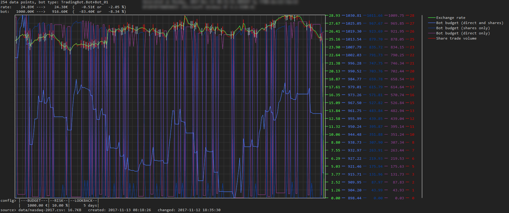

# Trading Bot

This project (mainly written in F# - the Haskell-version will follow soon) is dedicated to an automated bot designed to trade with shares/currencies/...
based on historical and/or live data.

It is currently in the developement phase, as the algorithm is not yet finished or near perfect.

The project also contains a 'visualization' sub-project, which renderes exchange rates and the bot's actions (buying, selling) into a large image file.
An example output could look as follows:

